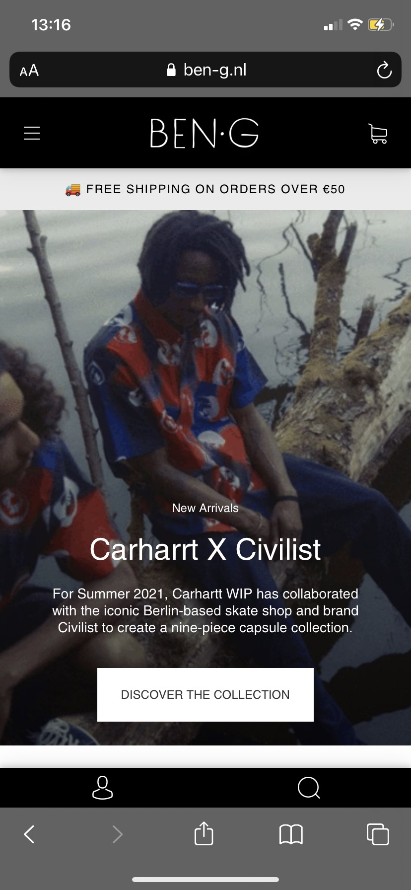
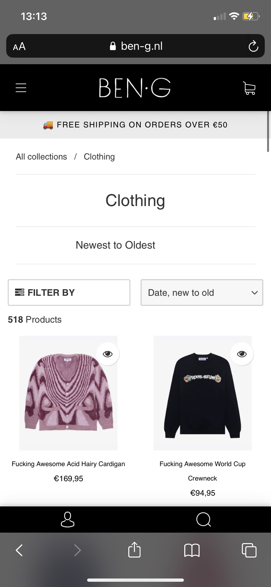

# Procesverslag
Markdown is een simpele manier om HTML te schrijven.  
Markdown cheat cheet: [Hulp bij het schrijven van Markdown](https://github.com/adam-p/markdown-here/wiki/Markdown-Cheatsheet).

Nb. De standaardstructuur en de spartaanse opmaak van de README.md zijn helemaal prima. Het gaat om de inhoud van je procesverslag. Besteedt de tijd voor pracht en praal aan je website.

Nb. Door *open* toe te voegen aan een *details* element kun je deze standaard open zetten. Fijn om dat steeds voor de relevante stuk(ken) te doen.

## Jij

uitwerken voor kick-off werkgroep

### Auteur:
Sjors Kiebert

#### Je startniveau:
Blauw

#### Je focus:
surface plane
 

## Je website

uitwerken voor kick-off werkgroep

### Je opdracht:
link naar de website die je gaat namaken óf de naam/omschrijving van je eigen ontwerp:
https://www.ben-g.nl

#### Screenshot(s) van de eerste pagina (small screen): 
zero state

#### Screenshot(s) van de tweede pagina (small screen):
product pagina  

 

## Breakdownschets (week 1)

uitwerken na afloop 2e werkgroep

[Breakdownschets V1.pdf](https://github.com/Kiebertje/Fed/files/7173016/Breakdownschets.V1.pdf)

## Voortgang 1 (week 2)

uitwerken voor 1e voortgang

### Stand van zaken
Ik had veel moeite om te beginnen met me site, maar toen ik eenmaal bezig was ging het voor mijn gevoel wel goed.
 Ik heb meerendeel van mijn tijd besteed aan het maken van het huiswerk en begrijpen hoe alles werkt. 
 Voor mijn gevoel gaat het wel goed, heb nog niet het gevoel dat ik vastloop en het is uitdagend genoeg.
 Het enige waar ik mee zit is dat ik niet zo goed weet hoe ver je op dit moment moet zijn.

 

### Agenda voor meeting
samen met je groepje opstellen

| student Sjors       | student Joost          | student Mack    | student Ryan        |
| ---                 | ---                    | ---             | ---              |
| Hoe kan ik mijn achterstand inhalen?     | en dit                 | en ik dit       | en dan ik dat    |
| Hoe ver moet je nu ongeveer zijn?| dit als er tijd is     | nog een punt    | dit wil ik zeker |
| ...                 | ...                    | ...             | ...              |

### Verslag van meeting
We hadden niks besproken, dus iedereen had zijn eigenwerk laten zien, uiteindelijk bleek het dat iedereen wat achterliep.
Wat ik erg nuttig vond was dat je iedereen ze werk kon zien en hiermee een beter idee kon krijgen hoe ver je ongeveer op dit moment moest zijn.
Ik heb uit her gesprek de volgende dingen gehaald:
 -ik moest een planning gaan maken
 -ik kan naar school gaan als ik thuis niet goed kan werken
 -ik kan het huiswerk doorlopen om te kijken hoe alles werkt

## Voortgang 2 (week 3)

uitwerken voor 2e voortgang

### Stand van zaken
Ik had minder moeite om te beginnen, maar vond het wel lastiger om de correcte code te schrijven, heb hier hulp bij gekregen van mede studenten en heb me java script afgemaakt en ben ook verder gegaan met me css en html

### Agenda voor meeting
samen met je groepje opstellen

| student Sjors   | student Joost      | student Mack | student Ryan     |
| ---             | ---                | ---          | ---              |
| Hoe erg moet je java script uitgewerkt zijn       | en dit             | en ik dit    | en dan ik dat    |
| Is mijn code netjes?  | dit als er tijd is | nog een punt | dit wil ik zeker |
| | ...                | ...          | ...              |

### Verslag van meeting

- punt 1: check of je foto's allemaal 1 formaat zijn (als je foto's in het midden wilt zetten)
- punt 2: gebruik 1 eenheid (alleen px of alleen em)
- punt 3: (later nagevraagd) je java script moet je drie dingen in terug zien queryselector,addeventlistener en classlist.

## Toegankelijkheidstest (week 4)

uitwerken na test in 8e voortgang

### Bevindingen
Lijst met je bevindingen die in de test naar voren kwamen:
 -tab-key moet duidelijker.
 -hamburgermenu kan je niet op tabben.
 -op de ben-g site zelf zorgt de tab-key voor verwarring.
 -voice over is verwarrend (voor mij).
 -als fingers zijn vastgebonden valt de site te bedienen.
 -met schokken valt de site wel te bedienen, alleen zijn sommige buttons te klein en kan scrollen een probleem.
 -suikerziekte bril is het wel te doen de tekst is groot genoeg en de plaatjes en buttons zijn duidelijk.
 -ballon oefening was niet erg relevant voor mijn website, maar het liet wel goed zien dat het moeilijk is om te navigeren en om een form in te vullen als je snel    bent afgeleid.
 -niet iedereen die kleurenblind is ziet hetzelfde, dus is dit aanpakken erg lastig.
 -voice over leest de alt van een afbeelding.

#### Door heen met tab-key.
Hier korte omschrijving (met indien nodig een afbeelding):
Als je door me website heeft tabt is het eerst wel duidelijk waar je bent maar als je even weg kwijt is het moeilijk om precies te zien waar je gebleven was.
 
Hier een omschrijving van hoe het opgelost kan worden (met indien nodig een afbeelding):
Dit probleem is makkelijk op te lossen door in de css de een focus toe te voegen hiermee kan je ervoor zorgen dat het duidelijker is waar de gebruiker zich op dat moment bevind.

#### Spasmes en spasticiteit. 
Hier korte omschrijving (met indien nodig een afbeelding):
Om dit te testen hebben we een schok apparaat op ons arm gezet en hierdoor kan je je arm en hand niet stil houden. Dit zorgt er dus voor dat je niet stabiel een muis of touchpad kan gebruiken. De meeste sites vallen wel nog te bedienen alleen als een button te klein is wordt het wel lastig, op mijn site zijn sommige buttons kleiner dan andere en staan ze ook in de hoeken dit maakt het dus lastiger voor iemand met spasmes om deze makkelijk te bedienen.

Hier een omschrijving van hoe het opgelost kan worden (met indien nodig een afbeelding):
Je kan een button groter maken of je kan ervoor zorgen dat je op plaatjes kan drukken(ipv een button). Een hamburgermenu is ook erg lastig te bedienen omdat deze redelijk te klein is dus op desktop zou ik deze vermeiden en een menubalk maken.

#### Beperkt zicht door suikerziekte. 
Hier korte omschrijving (met indien nodig een afbeelding):
Door een bril op te zetten met witte vlekken op de glazen kan je slecht zicht door suikerziekte immiteren. Wat al snel duidelijk werd was dat sommige kleuren moeilijker te zien waar op een specifeiek achtergronden. Wit op zwart was moeilijk te lezen terwijl zwart op wit wel goed te doen was.

Hier een omschrijving van hoe het opgelost kan worden (met indien nodig een afbeelding):
De oplossing hiervoor klinkt erg makkelijk, maar kan nog best moeilijk zijn. Je moet sommige kleur combinaties niet gebruiken, maar dat kan niet altijd. Ook iedereen heeft andere instelling op zijn apparaat (denk hierbij aan dark/light mode). Het is dus een goed idee om sommige kleur combinaties te vermeiden en ook om veel verschillende kleuren te gebruiken (dit kan de gebruiker helpen begrijpen dat het iets anders is dan de vorige pagina bijvoorbeeld).

#### Alt tekst bij een afbeelding. 
Hier korte omschrijving (met indien nodig een afbeelding):
Als je met voice over een afbeeldign leest leest de voice over de alt tekst. Als de alt niet duidelijk is of iets is in de richting van "afbeelding_5_mooi.gif" zal een gebruiker geen idee hebben waar hij naar kijkt. Als er geen alt is leest de voice over niks voor en dit helpt de gebruiker ook niet.

Hier een omschrijving van hoe het opgelost kan worden (met indien nodig een afbeelding):
Om dit op te lossen moet je een duidelijke alt bedenken waar de gerbuiker wat aan heeft. 

## Voortgang 3 (week 4)

uitwerken voor 3e voortgang

### Stand van zaken
hier dit ging goed & dit was lastig (neem ook screenshots op van delen van je website en code):
 Ik heb het gevoel dat ik zo goed als klaar ben moet alleen de tweede pagina nog style. Ik heb ook me code herschreven dat het meer profesioneel lijkt. De grootste verandering is denk ik de focus state ik vond het leuk om ermee te werken.

### Agenda voor meeting
samen met je groepje opstellen

| student Sjors     | student Joost         | student Mack   | student Ryan       |
| ---               | ---                | ---          | ---              |
| Wat moet er nog gebeuren?   | en dit             | en ik dit    | en dan ik dat    |
|      | dit als er tijd is | nog een punt | dit wil ik zeker |
|  | ...                | ...          | ...              |

### Verslag van meeting
Ik kon helaas niet aanwezig zijn bij deze meeting.

- punt 1: wat zijn jullie nog van plan te gaan doen?
- punt 2: extra animaties toevoegen als daar nog tijd voor is.
- punt 3: easter eggs indien daar tijd voor is.

## Eindgesprek (week 5)

uitwerken voor eindgesprek

### Stand van zaken
hier dit ging goed:
Ik vond het erg leuk om met de verschillende states te werken, omdat ik het leuk vond ging het me ook makkelijker af dan andere gedeeltes. Ook vond ik het intressant om met postioning te werken, na het huiswerk gemaakt te hebben begreep ik dat ook wel en kon ik zelf er mee aan de slag.

 

 
 

 
 
 
 
 
 
 

dit was lastig:
Ik vond het moeilijk om elementen goed aan te spreken zonder een class of id te gerbuiken, na een tijd begreep ik hoe nth-of-type werkte en welke andere maniere er zijn om elementen aan te spreken en toen lukte het wel. 
Ik had ook moeite met javascript, gelukkig hoefde we daar niet veel van te gebruiken en met hulp van een klasgenoot kwam ik er wel uit.

 

 
 

 
 
 

 

### Screenshot(s)
hier screenshot(s) van je eindresultaat:
 
 
 
 

 

 

 

 

 

## Herkansing

 
verslag van de meeting

 Het gaat best goe maar het is niet gneog voor een voldoende de volgende punten zijn besproken en moeten verbeterd worden:
 
 -punt 1 te weinig diverse content. Op mijn website heb ik voor afbeeldingen gebruikt en tekst ik dit is helaas niet divers genoeg. Dit zou je kunnen oplossen door een form te gebruiken of een video, etc.
 
 -punt 2 ik heb een hamburgermenu gemaakt alleen is deze nog niet tot in detail uitgewerkt. Er zou nog een transition in kunnen en je zou met de opacity kunnen spelen.
 
 -punt 3 de surface plane mag meer uitgewerkt worden. De keuze voor de surface plane komt nog niet erg naarvoren, ik moet meer de witruimte en uitlijning gaan letten dit zou er 1 moeten zijn en niet dat alles een beetje overal staat. Daarnaast zou ik ook meer met states kunnen doen voor de hover ondanks dat ik het voor mobiel maak is dit een grote toeving en zal mijn website meer tot leven brengen. Er mag dus meer toffe CSS in mijn site gepompt worden.
 
 -punt 4 ik heb twee voortgangs gesprekken gemist om dit in te halen moet ik een verslag maken over mijn herkansing. Hier stel ik de vragen wat ga je doen? en hoe ga ik dat aanpakken?
 
 Wat ga je doen?
 Bij de voor gaande punten heb ik dit eingelijk al vertelt, maar samengevat ga ik meer doen met css en meer diverse content in mijn website zetten.
 
 Hoe ga je dat aanpakken?
 Ik ga alle punten 1 voor 1 af, hierdoor kan ik makkelijk zien wat ik nog moet doen. Als ik ergens vast loop probeer ik eerst he tuit de huiswerk opdrachten te halen als dat niet lukt kijk ik of ik online kan vinden als de online code te ingewikkeld is vraag ik hulp bij een klasgenoot en als dat niet helpt zoek ik een andere oplossing. Op deze manier wil in CSS schrijven en mijn nieuwe content maken.
 
 Eindresultaat
 
 

 
 
 
 
 
 
 

 
 
 
 

 

 

## Bronnenlijst

continu bijhouden terwijl je werkt

Nb. Wees specifiek ('css-tricks' als bron is bijv. niet specifiek genoeg).

/* bron beng logo: https://www.ben-g.nl/collections/ben-g-select */
/* bron popcompany shop nu foto: https://www.seprun.com/search/pop-trading-company-big-pocket-shirt-black */
/* bron shoppingcar: https://icon-library.com/icon/cart-icon-png-white-11.html */
/* bar menu: https://icon-library.com/icon/white-hamburger-menu-icon-24.html */
/* bron palace(instagram):https://www.shopenauer.com/en/brand/palace-skateboards/utrecht */
/* bron polar (instagram):https://news.nike.com/news/converse-cons-and-polar-skate-co-debut-first-footwear-and-apparel-collection */
/* bron rassvet (instagram): https://www.vogue.fr/vogue-hommes-en/article/rassvet-the-label-that-celebrates-skate-culture */
/* bron ben-g dunks (instagram): https://sneakernews.com/2019/09/22/ben-g-nike-sb-dunk-low-release-date/ */
/* bron supreme dunks (instagram): https://www.highsnobiety.com/p/supreme-nike-sb-dunk-low-hyper-blue-release-date-price/ */
/* bron the hundereds (instagram): https://thehundreds.uk/blogs/content/the-hundreds-x-one-piece?country=NL */ 
/* bron shop the look: https://webshop.poptradingcompany.com/products/pop-full-zip-knitted-vest-spruce-yellow */
/* bron obey: https://obeyclothing.eu/products/obey-icon-heavyweight-pullover-hood */
/* bron skateboard: https://nl.pinterest.com/pin/53409945570494034/ */
/* bron pop pagina 2: https://webshop.poptradingcompany.com/products/pop-full-zip-knitted-vest-spruce-yellow */

  
